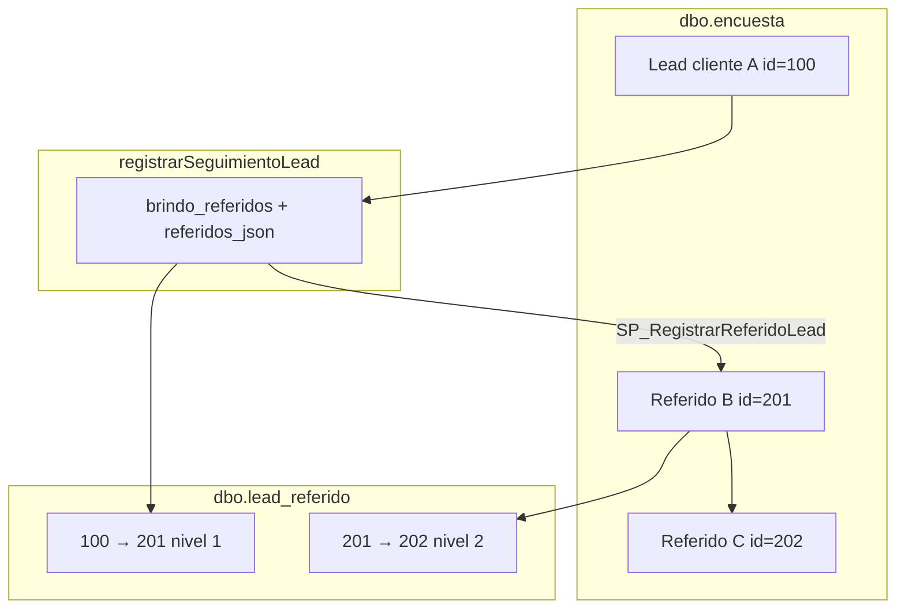

# Referidos vinculados a encuesta

**Índice:** [INDICE_FUNCIONALIDADES.md](./INDICE_FUNCIONALIDADES.md)  
**Script DBA:** [../sql/lead_referido-tabla-sp.sql](../sql/lead_referido-tabla-sp.sql)

---

## Problema actual

| Dónde vive hoy el referido | ¿Aparece en `encuestasMuestraOperador`? |
|----------------------------|----------------------------------------|
| `registrarSeguimientoLead.referidos_json` | **No** — solo JSON en seguimiento |
| Carga automática vía `encuestaCargaSorteo01` (app) | **A veces** — crea fila en `encuesta` pero **sin vínculo** al padre ni reglas de visibilidad |
| Bandeja promotor / supervisor | Solo ve lo que devuelve el SP de listado |

Los referidos quedan “invisibles” o mezclados con leads normales, sin etiqueta **Referido**, sin árbol padre→hijo, y sin base para **descuentos por cuota**.

---

## Modelo propuesto



1. **`encuesta`** — cada referido es un lead más (teléfono + campaña), igual que QR o carga manual.  
2. **`lead_referido`** — tabla de **relación** (quién refirió a quién, nivel, quién cargó, visibilidad).  
3. **`registrarSeguimientoLead`** — sigue guardando `referidos_json` en el cierre; la app dispara el SP que crea encuesta + vínculo.

---

## Tabla `dbo.lead_referido`

| Columna | Uso |
|---------|-----|
| `id_encuesta_referido` | PK de `encuesta` del contacto nuevo |
| `id_encuesta_origen` | Lead que dio el referido (puede ser otro referido) |
| `id_encuesta_raiz` | Cliente raíz de la cadena (descuentos) |
| `nivel` | 1 = directo, 2 = referido de referido, … |
| `operador_rol` | `promotor` \| `supervisor` — **define visibilidad** |
| `visible_promotor` | Calculado: 1 solo si cargó un promotor |
| `id_vendedor` / `id_supervisor` | Equipo comercial heredado del padre |
| `id_registro_seguimiento` | Trazabilidad al guardado que originó el alta |

**Unique:** `(encuesta, telefono_referido)` — no duplicar el mismo teléfono como referido en la campaña.

---

## Reglas de visibilidad

| Quién cargó el referido | Promotor lo ve | Supervisor lo ve |
|-------------------------|----------------|------------------|
| **Promotor** | Sí | Sí |
| **Supervisor** | **No** | Sí |

Implementación:

- Columna calculada `visible_promotor` en `lead_referido`.
- El DBA debe ajustar **`encuestasMuestraOperador`** para excluir filas donde `operador_rol = supervisor` cuando el login es promotor (`@idVendedor`).

Ejemplo (promotor):

```sql
AND NOT EXISTS (
  SELECT 1 FROM dbo.lead_referido lr
  WHERE lr.id_encuesta_referido = e.id
    AND lr.operador_rol = N'supervisor'
    AND lr.id_vendedor = @idVendedor
)
```

---

## SP `SP_RegistrarReferidoLead`

Parámetros principales:

| Parámetro | Origen app |
|-----------|------------|
| `@id_encuesta_origen` | `lead.id` del cliente que cerró / dio referidos |
| `@telefono`, `@nombre` | Cada ítem de `seguimiento.referidos[]` |
| `@encuesta` | `sorteo01` / `ENCUESTA_CARGA_ID` |
| `@usuario` | Código promotor del lead padre |
| `@operador_id`, `@operador_rol` | Sesión login |
| `@id_registro_seguimiento` | Id fila recién insertada en seguimiento (opcional) |

Flujo interno:

1. Valida origen en `encuesta`.
2. Calcula `nivel` e `id_encuesta_raiz` si el origen ya era referido.
3. `EXEC encuestaCargaSorteo01` (mismo upsert que carga manual).
4. `INSERT lead_referido`.
5. Retorna `id_encuesta_referido`, `codigo`, `gestionCodigo`, `mensaje`.

---

## SP `SP_ObtenerMetaReferidosLead` (consulta para la app)

La app **no** hace `SELECT` directo sobre `lead_referido`. Solo `EXECUTE` en SPs.

```sql
EXEC dbo.SP_ObtenerMetaReferidosLead @ids_encuesta = N'100,201,202';
-- Devuelve: id_encuesta_referido, id_encuesta_origen, id_encuesta_raiz, nivel, operador_rol, visible_promotor
```

Usado para etiqueta **Referido** y filtro de visibilidad (referidos de supervisor ocultos al promotor).

---

## SP `SP_ContarReferidosLead` (descuentos)

Cuenta referidos directos y/o cadena completa, opcionalmente solo los que **cerraron** (`resultado_entrevista = compro` en seguimiento).

Uso futuro en app o reporte DBA:

```sql
DECLARE @t INT, @d INT;
EXEC dbo.SP_ContarReferidosLead
  @id_encuesta = 100,
  @solo_con_cierre = 1,
  @incluir_cadena = 1,
  @total = @t OUTPUT,
  @total_directos = @d OUTPUT;
```

---

## Integración en la app (Node)

| Variable `.env` | Default | Descripción |
|-----------------|---------|-------------|
| `REFERIDOS_AUTO_CARGA` | `true` | Activa alta al guardar seguimiento |
| `SP_REGISTRAR_REFERIDO` | `SP_RegistrarReferidoLead` | Alta encuesta + vínculo |
| `SP_OBTENER_META_REFERIDO` | `SP_ObtenerMetaReferidosLead` | Metadatos para badge y visibilidad |
| `SP_CARGA_ORIGEN_REFERIDO` | `2` | `@origen` en carga (DBA puede definir otro código “Referido”) |

**Permisos MPCSP:** solo `GRANT EXECUTE` en los tres SP anteriores + `SP_ContarReferidosLead`. Sin `GRANT` en tabla `lead_referido`.

Cuando `SP_REGISTRAR_REFERIDO` está desplegado, `server/db/referidos-carga.js` llama al SP en lugar de solo `encuestaCargaSorteo01`.

Campos app nuevos en seguimiento:

- `referidosGenerados[]` — idempotencia (teléfono ya procesado).
- En UI: badge **Referido** si el listado trae `es_referido` / join (pendiente columna en SP listado).

---

## Checklist DBA

- [ ] Crear `lead_referido` + SPs (`sql/lead_referido-tabla-sp.sql`)
- [ ] Ajustar nombres de columnas `idVendedor` / `idSupervisor` en el script si difieren en `encuesta`
- [ ] Validar parámetros reales de `encuestaCargaSorteo01` (nombres `@campoNCodigo`)
- [ ] Modificar `encuestasMuestraOperador`: filtro visibilidad + columnas `es_referido`, `id_encuesta_origen`, `nivel`
- [ ] `GRANT EXECUTE` a `MPCSP` en SPs (no en tabla `lead_referido`)
- [ ] Definir con negocio: `@origen` específico para referidos (ej. `'3'`) vs manual `'2'`
- [ ] Reglas de descuento por cuota (cuántos referidos, directos vs cadena, solo cierres)

---

## Relacionado

- [FUNCIONALIDAD_CARGA_MANUAL_ORIGEN2.md](./FUNCIONALIDAD_CARGA_MANUAL_ORIGEN2.md)
- [FUNCIONALIDAD_MODELO_SEGUIMIENTO_SQL.md](./FUNCIONALIDAD_MODELO_SEGUIMIENTO_SQL.md)
- [ESTRUCTURAS_TABLAS_SP.md](./ESTRUCTURAS_TABLAS_SP.md)
- Código: `server/db/referidos-carga.js`, `LeadModalForm.tsx` (sección Referidos)
