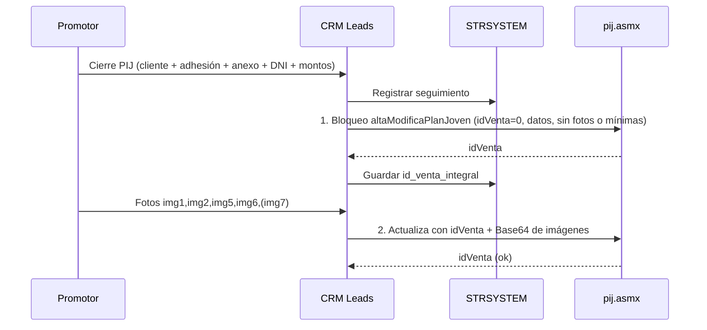

# Integración CRM → Sistema integral PIJ (SOAP)

**Fecha:** 2026-07-13 (impl. 2026-07-14)  
**Estado:** implementado (flag `PIJ_SOAP_ENABLED`, off por defecto)  
**Servicio del ingeniero:** [PIJ Servicio Web](https://www.miprimercasa.ar/pij/pij.asmx)  
**Operación:** [altaModificaPlanJoven](https://www.miprimercasa.ar/pij/pij.asmx?op=altaModificaPlanJoven)  
**WSDL:** `https://www.miprimercasa.ar/pij/pij.asmx?WSDL`

Relacionado: [REQUISITOS_INTEGRACION_CAJA_SUCURSAL_PIJ.md](./REQUISITOS_INTEGRACION_CAJA_SUCURSAL_PIJ.md) (stock adhesión/anexo) · [ALMACEN_IMAGENES_CIERRE_PIJ.md](./ALMACEN_IMAGENES_CIERRE_PIJ.md)

### Código en el CRM

| Pieza | Ubicación |
|-------|-----------|
| Config | `server/config/pij-soap-config.js` |
| Cliente SOAP | `server/services/pij-soap-client.js` |
| Orquestación bloqueo → fotos | `server/services/pij-integral-sync.js` |
| Hook al guardar + reintento | `PATCH /api/leads/:id/seguimiento`, `POST /api/leads/:id/pij-integral/reintentar` |
| Prueba manual | `scratch/probar-pij-soap.mjs` |

Variables: `PIJ_SOAP_ENABLED`, `PIJ_SOAP_URL`, `PIJ_SOAP_NAMESPACE`, `PIJ_SOAP_TIMEOUT_MS`.

Tras un cierre PIJ se guarda en el JSON: `idVentaIntegral`, `pijIntegralEstado` (`pendiente` / `bloqueado` / `fotos_ok` / `error`), `pijIntegralError`, `pijIntegralEnviadoEn`. Si el WS falla, el cierre CRM permanece y se puede reintentar desde el modal.

---

## 1. Qué es

Web service **ASMX / SOAP** (.NET) del sistema integral de Mi Primer Casa. Expone **una sola operación**:

| Operación | Descripción |
|-----------|-------------|
| `altaModificaPlanJoven` | Registra o actualiza una venta PIJ: bloquea/carga anexo en el integral y permite actualizar / agregar imágenes después usando el **id de venta** que devuelve. |

No hay otras operaciones en el servicio público (p. ej. no lista stock de adhesiones).

---

## 2. Endpoint técnico

| Ítem | Valor |
|------|--------|
| URL | `https://www.miprimercasa.ar/pij/pij.asmx` |
| Namespace | `http://190.106.131.63/MPC/PIJ` |
| SOAPAction | `http://190.106.131.63/MPC/PIJ/altaModificaPlanJoven` |
| Binding | SOAP 1.1 y SOAP 1.2 |
| Respuesta | `altaModificaPlanJovenResult` → **`int`** (id de venta en el integral) |

Prueba HTML del ASMX: solo desde el equipo local del servidor (no sirve desde el browser del CRM).

---

## 3. Parámetros de `altaModificaPlanJoven`

| Parámetro SOAP | Tipo (WSDL) | Oblig. WSDL | Significado probable |
|----------------|-------------|-------------|----------------------|
| `idVenta` | int | sí | `0` = alta nueva; `>0` = modifica venta existente + imágenes |
| `idVendedor` | int | sí | Código vendedor en el integral (¿mismo que operador/idVendedor CRM?) |
| `solicitud` | string | no | N° de **adhesión / solicitud** (texto) |
| `anexo` | int | sí | N° de **anexo** |
| `montoEfectivo` | double | sí | Parte efectivo (0 si solo transferencia) |
| `montoTransferencia` | double | sí | Parte transferencia (0 si solo efectivo) |
| `fechaAnexo` | dateTime | sí | Fecha/hora del anexo / cierre |
| `nombreCliente` | string | no | Nombre |
| `numeroDocumentoCliente` | string | no | DNI |
| `domicilioCliente` | string | no | Domicilio de la encuesta (`lead.domicilio`) |
| `numeroTelefonoCliente` | string | no | Teléfono |
| `imgDocumentoAnverso` | base64Binary | sí | DNI frente |
| `imgDocumentoReverso` | base64Binary | sí | DNI reverso |
| `imgSolicitud` | base64Binary | sí | = CRM **`img5`** (consentimiento / solicitud) |
| `imgAnexo` | base64Binary | sí | Foto del anexo |
| `imgcomprobanteMEP` | base64Binary | sí | Comprobante medio de pago electrónico (transferencia) |

\* Confirmado en la doc del ASMX (SOAP 1.1 / 1.2): las imágenes van como **`base64Binary`**. El CRM usa **SOAP 1.1** (`text/xml` + `SOAPAction`) en `server/services/pij-soap-client.js`.

---

## 4. Mapeo CRM → SOAP

| SOAP | Origen CRM | Estado |
|------|------------|--------|
| `idVenta` | `0` en el **bloqueo** (alta); luego el `int` que devolvió el WS | **Falta** persistir `id_venta_integral` |
| `idVendedor` | `operador_id` / `idVendedor` del promotor | Confirmar paridad con el integral |
| `solicitud` | `serie` + `nro_adhesion` + `/300` (ej. `A200/300`) | OK — confirmado DBA |
| `anexo` | `nro_anexo` | OK (int) |
| `montoEfectivo` | `monto_efectivo` (0 si solo transferencia) | OK |
| `montoTransferencia` | `monto_transferencia` (0 si solo efectivo) | OK |
| `fechaAnexo` | `fecha_cierre` | Asegurar persistencia |
| `nombreCliente` | `lead.nombre` | OK |
| `numeroDocumentoCliente` | `dni_cliente` / `dniCliente` | OK |
| `domicilioCliente` | `lead.domicilio` (dato de la **encuesta**) | OK — ya viene en el lead |
| `numeroTelefonoCliente` | `lead.telefono` | OK |
| `imgDocumentoAnverso` | **`img1`** DNI frente | OK |
| `imgDocumentoReverso` | **`img2`** DNI reverso | OK |
| `imgSolicitud` | **`img5`** Consentimiento / solicitud | OK — confirmado |
| `imgAnexo` | **`img6`** Foto de anexo | OK |
| `imgcomprobanteMEP` | **`img7`** Comprobante transferencia | OK si transferencia/mixto |

Serie `A`/`B`: va **dentro** de `solicitud` (ej. `A200/300`). No hay parámetro SOAP aparte.

### Fotos CRM ↔ SOAP (resumen)

| Código CRM | Etiqueta UI | Parámetro SOAP |
|------------|-------------|----------------|
| `img1` | DNI frente | `imgDocumentoAnverso` |
| `img2` | DNI reverso | `imgDocumentoReverso` |
| `img5` | Consentimiento / solicitud | `imgSolicitud` |
| `img6` | Foto de anexo | `imgAnexo` |
| `img7` | Comprobante transferencia | `imgcomprobanteMEP` |

---

## 5. Flujo confirmado (bloqueo → idVenta → fotos)

Según negocio / ingeniero:

1. **Alta con fotos:** el CRM envía en **un solo POST** datos del lead (adhesión, anexo, DNI, montos, domicilio) + imágenes Base64, con `idVenta = 0`.
2. El WS responde el **`idVenta`** → el CRM lo guarda (`idVentaIntegral`, estado `fotos_ok`).
3. Si ya existe `idVentaIntegral` y hace falta reenviar, se llama de nuevo con ese id + fotos.



Notas de implementación pendientes de detalle fino con el ingeniero:

- Si el **primer** llamado puede ir **sin** imágenes (solo datos) o exige blobs vacíos.
- Si las fotos van en **un solo** segundo POST o una por llamada.
- Qué hacer si falla el bloqueo vs si falla solo el paso de fotos.

Momento de disparo en el CRM (a elegir):

1. Automático al guardar el cierre (bloqueo) + al completar fotos, o  
2. Botón “Enviar / bloquear en sistema integral”, o  
3. Cola con reintentos.

---

## 6. Relación con el stock de adhesión/anexo

Este SOAP **consume** `solicitud` + `anexo` ya elegidos. **No entrega** rangos de numeración.

El stock “de tal a tal” por promotor (caja sucursal) sigue siendo el otro brazo de la integración ([REQUISITOS…](./REQUISITOS_INTEGRACION_CAJA_SUCURSAL_PIJ.md)). Preguntar al ingeniero si hay **otro** endpoint/SP para consultar stock.

---

## 7. Riesgos / dudas técnicas (con el ingeniero)

**Resueltas:**

| Tema | Definición |
|------|------------|
| Flujo | 1) Bloqueo con datos cliente + adhesión + anexo + DNI → `idVenta` · 2) Luego carga de fotos |
| `domicilioCliente` | Viene de la encuesta → `lead.domicilio` |
| `imgSolicitud` | = **`img5`** (consentimiento / solicitud) |

**Pendientes:**

1. ¿`idVenta = 0` siempre crea el bloqueo? ¿Códigos de error / retorno negativo?
2. ¿Tope de tamaño por imagen / request? (serialización = Base64 confirmada)
3. ¿`idVendedor` CRM = integral?
4. Primer llamado: ¿sin imágenes o con placeholders vacíos?
5. Pago solo efectivo: ¿`img7` / `montoTransferencia = 0`?
6. ¿Auth / allowlist / ambiente de prueba?
7. ~~¿La serie A/B viaja en `solicitud`?~~ → Sí: formato `A200/300`.

---

## 8. Estado de implementación CRM

| Ítem | Estado |
|------|--------|
| Cliente SOAP + orquestación | Hecho (`pij-soap-client` / `pij-integral-sync`) |
| `idVentaIntegral` en JSON seguimiento | Hecho |
| Domicilio encuesta | Hecho (`lead.domicilio`) |
| Mapping imágenes | Hecho |
| img5 obligatoria | Hecho |
| Reintento UI + API | Hecho |
| Flag `PIJ_SOAP_ENABLED` | Hecho (default off) |
| Columna plana SQL `id_venta_integral` | Pendiente DBA (opcional) |
| Compras adicionales → integral | Pendiente (v2) |
| Stock adhesión | Endpoint aparte (aún no en este ASMX) |

---

## 9. Ejemplo conceptual de request (SOAP 1.1)

Valores de la prueba lead 3906 (sin bytes reales):

```xml
POST /pij/pij.asmx HTTP/1.1
Host: www.miprimercasa.ar
Content-Type: text/xml; charset=utf-8
SOAPAction: "http://190.106.131.63/MPC/PIJ/altaModificaPlanJoven"

<?xml version="1.0" encoding="utf-8"?>
<soap:Envelope xmlns:xsi="http://www.w3.org/2001/XMLSchema-instance"
               xmlns:xsd="http://www.w3.org/2001/XMLSchema"
               xmlns:soap="http://schemas.xmlsoap.org/soap/envelope/">
  <soap:Body>
    <altaModificaPlanJoven xmlns="http://190.106.131.63/MPC/PIJ">
      <idVenta>0</idVenta>
      <idVendedor>132</idVendedor>
      <solicitud>A2000/300</solicitud>
      <anexo>2000</anexo>
      <montoEfectivo>0</montoEfectivo>
      <montoTransferencia>33000</montoTransferencia>
      <fechaAnexo>2026-07-13T18:11:54</fechaAnexo>
      <nombreCliente>...</nombreCliente>
      <numeroDocumentoCliente>20202020</numeroDocumentoCliente>
      <domicilioCliente></domicilioCliente>
      <numeroTelefonoCliente>5493704298294</numeroTelefonoCliente>
      <imgDocumentoAnverso><!-- base64 img1 --></imgDocumentoAnverso>
      <imgDocumentoReverso><!-- base64 img2 --></imgDocumentoReverso>
      <imgSolicitud><!-- ? --></imgSolicitud>
      <imgAnexo><!-- base64 img6 --></imgAnexo>
      <imgcomprobanteMEP><!-- base64 img7 --></imgcomprobanteMEP>
    </altaModificaPlanJoven>
  </soap:Body>
</soap:Envelope>
```

Respuesta esperada: entero `idVenta` para guardar y reutilizar.
