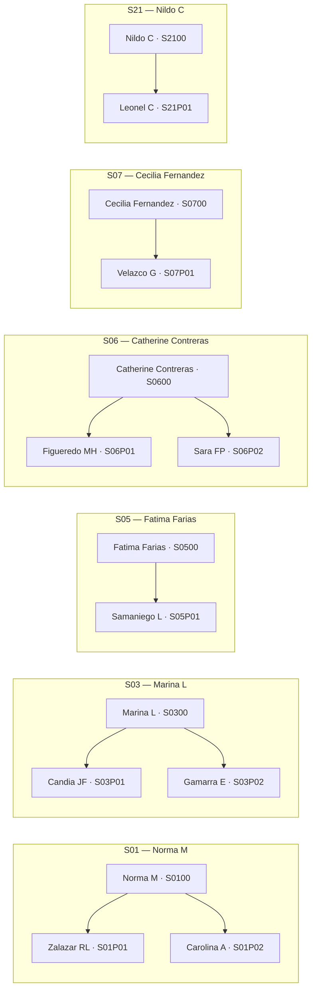

# Organigrama — Área de Ventas (Sorteo 01)

**Fuente:** `STRSYSTEM.dbo.rptLinkQRenRedesSociales` (35 operadores activos, jun. 2026)  
**Estructura operativa en sistema:** cada equipo `Sxx` tiene un supervisor (`…Sxx00`) y promotores (`…SxxP01`, `…SxxP02`, …).

> **Jerarquía comercial acordada:** **Federico Ceballos** (`Federico C` — `SORTEO01S0400`) como **supervisor del área de ventas**, con los supervisores de equipo y promotores debajo.

---

## Vista general

```mermaid
flowchart TB
  MPC["Mi Primer Casa S.A."]
  AV["Área de Ventas — Sorteo 01"]
  FC["Federico Ceballos<br/><b>Supervisor Área Ventas</b><br/>SORTEO01S0400"]

  MPC --> AV
  AV --> FC

  FC --> MQ["Martin Q<br/>ROTATIVO"]
  FC --> E01["Equipo S01 · Norma M"]
  FC --> E02["Equipo S02 · Adela Alcaraz"]
  FC --> E03["Equipo S03 · Marina L"]
  FC --> E05["Equipo S05 · Fatima Farias"]
  FC --> E06["Equipo S06 · Catherine Contreras"]
  FC --> E07["Equipo S07 · Cecilia Fernandez"]
  FC --> E08["Equipo S08 · Tania García"]
  FC --> E09["Equipo S09 · Giselle Roa"]
  FC --> E10["Equipo S10 · Naara Pona"]
  FC --> E11["Equipo S11 · Christian R"]
  FC --> E12["Equipo S12 · Carlos G"]
  FC --> E13["Equipo S13 · Johnatan O"]
  FC --> E14["Equipo S14 · Lucia N"]
  FC --> E15["Equipo S15 · Santiago M"]
  FC --> E16["Equipo S16 · Favio F"]
  FC --> E17["Equipo S17 · Arturo G"]
  FC --> E18["Equipo S18 · Belen A"]
  FC --> E19["Equipo S19 · Estefania G"]
  FC --> E20["Equipo S20 · Dahiana C"]
  FC --> E21["Equipo S21 · Nildo C"]
  FC --> E22["Equipo S22 · Martiniano S"]
  FC --> E23["Equipo S23 · Patricia A"]
  FC --> E24["Equipo S24 · Osvaldo S"]

  style FC fill:#9A1620,color:#fff
  style AV fill:#F5DDDF,color:#3D070C
```

---

## Detalle por equipo (supervisor → promotores)

---

## Tabla completa

| Equipo | Rol | Nombre en sistema | Código QR |
|--------|-----|-------------------|-----------|
| **Área** | **Supervisor área ventas** | **Federico Ceballos** (Federico C) | `SORTEO01S0400` |
| Rotativo | Supervisor | Martin Q | `SORTEO01ROTATIVO` |
| S01 | Supervisor | Norma M | `SORTEO01S0100` |
| S01 | Promotor | Zalazar RL (Zalazar Leonor) | `SORTEO01S01P01` |
| S01 | Promotor | Carolina A (Aguirre Carolina) | `SORTEO01S01P02` |
| S02 | Supervisor | Adela Alcaraz | `SORTEO01S0200` |
| S03 | Supervisor | Marina L | `SORTEO01S0300` |
| S03 | Promotor | Candia JF | `SORTEO01S03P01` |
| S03 | Promotor | Gamarra E | `SORTEO01S03P02` |
| S04 | Supervisor equipo | Federico Ceballos (Federico C) | `SORTEO01S0400` |
| S05 | Supervisor | Fatima Farias | `SORTEO01S0500` |
| S05 | Promotor | Samaniego L | `SORTEO01S05P01` |
| S06 | Supervisor | Catherine Contreras | `SORTEO01S0600` |
| S06 | Promotor | Figueredo MH | `SORTEO01S06P01` |
| S06 | Promotor | Sara FP (Pascal Ramírez SF) | `SORTEO01S06P02` |
| S07 | Supervisor | Cecilia Fernandez | `SORTEO01S0700` |
| S07 | Promotor | Velazco G | `SORTEO01S07P01` |
| S08 | Supervisor | Tania García | `SORTEO01S0800` |
| S09 | Supervisor | Giselle Roa | `SORTEO01S0900` |
| S10 | Supervisor | Naara Pona | `SORTEO01S1000` |
| S11 | Supervisor | Christian R (Cristian Rocdan) | `SORTEO01S1100` |
| S12 | Supervisor | Carlos G | `SORTEO01S1200` |
| S13 | Supervisor | Johnatan O | `SORTEO01S1300` |
| S14 | Supervisor | Lucia N | `SORTEO01S1400` |
| S15 | Supervisor | Santiago M | `SORTEO01S1500` |
| S16 | Supervisor | Favio F | `SORTEO01S1600` |
| S17 | Supervisor | Arturo G | `SORTEO01S1700` |
| S18 | Supervisor | Belen A | `SORTEO01S1800` |
| S19 | Supervisor | Estefania G | `SORTEO01S1900` |
| S20 | Supervisor | Dahiana C | `SORTEO01S2000` |
| S21 | Supervisor | Nildo C | `SORTEO01S2100` |
| S21 | Promotor | Leonel C | `SORTEO01S21P01` |
| S22 | Supervisor | Martiniano S | `SORTEO01S2200` |
| S23 | Supervisor | Patricia A | `SORTEO01S2300` |
| S24 | Supervisor | Osvaldo S | `SORTEO01S2400` |

---

## Resumen numérico

| Concepto | Cantidad |
|----------|----------|
| Supervisor área ventas | 1 (Federico Ceballos) |
| Supervisores de equipo | 24 (+ Martin Q rotativo) |
| Promotores | 9 |
| **Total operadores campo** | **34** (sin contar SUPERUSUARIO técnico) |

### Equipos con promotores asignados

| Equipo | Supervisor | Promotores |
|--------|------------|------------|
| S01 | Norma M | Zalazar RL, Carolina A |
| S03 | Marina L | Candia JF, Gamarra E |
| S05 | Fatima Farias | Samaniego L |
| S06 | Catherine Contreras | Figueredo MH, Sara FP |
| S07 | Cecilia Fernandez | Velazco G |
| S21 | Nildo C | Leonel C |

### Equipos solo supervisor (sin promotor en SP hoy)

S02, S04, S08, S09, S10, S11, S12, S13, S14, S15, S16, S17, S18, S19, S20, S22, S23, S24 + rotativo Martin Q.

---

## Notas

1. Los nombres entre paréntesis son alias de planilla / login cuando difieren del SP (`Christian R` = Cristian Rocdan, etc.).
2. En STRSYSTEM, Federico figura como **supervisor del equipo S04** (`SORTEO01S0400`); en este organigrama se lo ubica además como **supervisor del área de ventas** sobre todos los equipos.
3. **Sara FP** pasó al equipo de **Catherine Contreras** (`SORTEO01S06P02`). En STRSYSTEM puede seguir como `S07P02` hasta que el DBA actualice `rptLinkQRenRedesSociales` y `operadorAccesoCategoria`.
4. Para actualizar: `node scripts/generate-operadores-planilla.mjs` o consultar `rptLinkQRenRedesSociales` en SQL Server.
