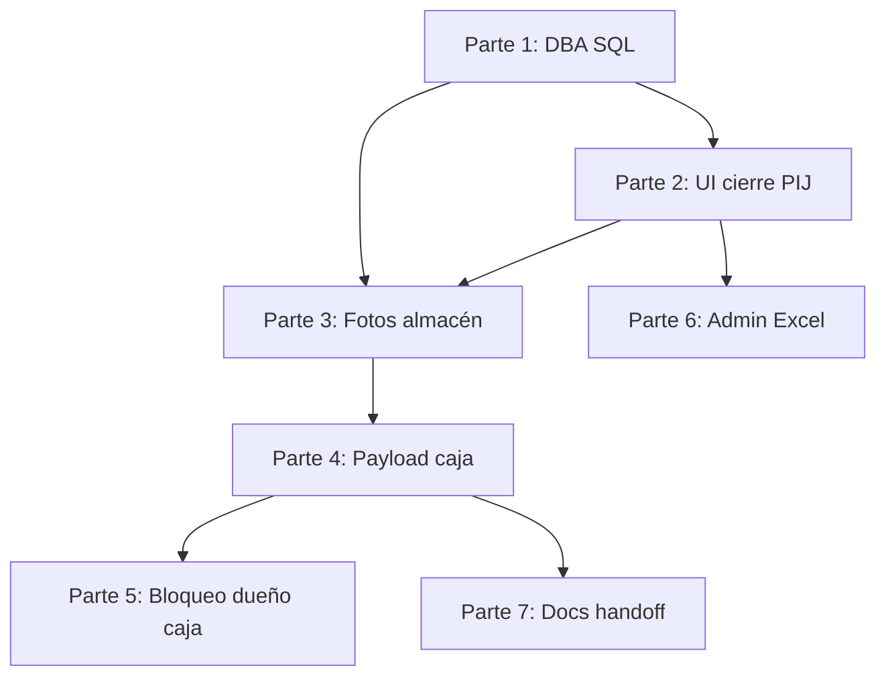

# Plan de subida parcial — PIJ / Caja / columnas planas

**Fecha:** 2026-07-23  
**Estado:** trabajo pendiente en working tree de `main` (sin ramas aún)  
**Objetivo:** subir a producción **parte por parte**, con descripción, dependencias y checklist, sin mezclar todo en un solo deploy.

Relacionado:

- [DESPLIEGUE_COLUMNAS_PLANAS_SEGUIMIENTO.md](./DESPLIEGUE_COLUMNAS_PLANAS_SEGUIMIENTO.md)
- [ALMACEN_IMAGENES_CIERRE_PIJ.md](./ALMACEN_IMAGENES_CIERRE_PIJ.md)
- [INTEGRACION_CAJA_SUCURSAL_MYSQL.md](./INTEGRACION_CAJA_SUCURSAL_MYSQL.md)
- [PROMPT_IA_CAJA_BLOQUEO_PIJ.md](./PROMPT_IA_CAJA_BLOQUEO_PIJ.md)
- [BLOQUEO_PIJ_VIA_SP.md](./BLOQUEO_PIJ_VIA_SP.md)
- [DEPLOY_VPS.md](./DEPLOY_VPS.md)

---

## 1. Reglas generales

1. **Orden fijo:** DBA → UI cierre → fotos → payload caja → dueño bloqueo → admin Excel → docs.
2. **No subir** a git/prod: `data/cierres-pij/`, `data/pij-soap-logs/`, `data/backups/`, `scratch/`, `.env` reales, fotos de prueba.
3. Sí subir plantillas: `.env.example`, `deploy/.env.vps.example`.
4. Archivos **mezclados** (`LeadModalForm.tsx`, `seguimiento-sql.js`, `create-app.js`, `schemas/seguimiento.js`): al armar cada rama, stagear **solo hunks** de esa parte (no `git add .`).
5. Antes de mover trabajo: dejar un snapshot recuperable (`git stash create` + `refs/backup/...`) o una rama `wip/todo-pij-caja`.
6. Cada parte = **una rama** + **un PR** + **un deploy** (o al menos un merge a `main` verificable).
7. Tras cada merge: smoke test en staging/prod según checklist de esa parte.

### Ya está en `origin/main` (no volver a meter)

| Commit (aprox.) | Qué |
|-----------------|-----|
| `7a55908` | API `/api/caja` sync MySQL |
| `6891165` | Sucursal ERP al publicar |
| `7bf3498` | `fechaCierre` a caja en hora Argentina |

---

## 2. Orden de subida (diagrama)



| # | Rama sugerida | Título PR | Puede ir en paralelo |
|---|---------------|-----------|----------------------|
| 1 | `feat/dba-columnas-planas-pij` | SQL: columnas planas + DNI + adhesión + imágenes + id venta | No (base) |
| 2 | `feat/ui-cierre-pij` | UI/API: cierre PIJ (DNI, pagos, adhesión/anexo) | Tras 1 |
| 3 | `feat/imagenes-cierre-pij` | Fotos cierre PIJ + API descarga caja | Tras 1+2 |
| 4 | `feat/caja-payload-bloqueos-pij` | Payload pendiente: `bloqueosPij`, vendedor, solo PIJ | Tras 3 |
| 5 | `feat/pij-bloqueo-owner-caja` | CRM deja bloqueo a caja; SP/SOAP + confirmación | Tras 4 |
| 6 | `feat/admin-export-excel` | Export Excel informe / recontacto | Tras 2 (o solo) |
| 7 | `docs/pij-caja-handoff` | Docs handoff caja / SOAP / checklist DBA | Con 4–5 |

---

## 3. Parte 1 — Fundación SQL (DBA)

### Descripción

Scripts para STRSYSTEM: columnas planas de seguimiento, DNI cliente, adhesión/anexo, medio de pago, imágenes de cierre, `id_venta_integral` / estado PIJ integral, consulta enriquecida. **Sin esto, la app nueva puede fallar o no persistir campos.**

### Archivos (código / scripts)

```
sql/registrarSeguimientoLead-columnas-planas-completas.sql
sql/registrarSeguimientoLead-tablas-hijas.sql
sql/MigrarSeguimientoJsonAColumnasPlanas.sql
sql/aplicar-dni-cliente.sql
sql/SP_RegistrarSeguimientoLead-adhesion-anexo.sql
sql/SP_RegistrarSeguimientoLead-medio-pago.sql
sql/SP_RegistrarSeguimientoLead-imagenes-cierre.sql
sql/SP_RegistrarSeguimientoLead-id-venta-integral.sql
sql/SP_RegistrarSeguimientoLead-notas.sql   (si aporta notas de la versión)
sql/spConsultarSeguimiento.sql
sql/SP_ExportarCierresParaBloqueo.sql      (opcional / DBA)
sql/DBA_VerYExportarImagenesCierrePij.sql  (opcional / DBA)
docs/DESPLIEGUE_COLUMNAS_PLANAS_SEGUIMIENTO.md
```

### Deploy

1. Backup STRSYSTEM.
2. Aplicar scripts en el orden del doc de despliegue (columnas → migración JSON → ALTER SP).
3. Verificar `SP_RegistrarSeguimientoLead` y `spConsultarSeguimiento` (o el nombre real en prod).
4. `GRANT EXECUTE` al usuario de la app (y más adelante al de caja para `loteVentaBloqueoVendedorPIJ`).

### Checklist

- [ ] Columnas nuevas existen
- [ ] SP registra y consulta sin error
- [ ] Rollback documentado / backup OK
- [ ] Merge a `main` de los `.sql` + doc (aunque DBA ya haya corrido a mano)

### Riesgo

**Alto** si se despliega Node (partes 2–5) sin este paso.

---

## 4. Parte 2 — UI y persistencia de cierre PIJ

### Descripción

Promotor/supervisor captura DNI, medio de pago, adhesión/anexo y datos de venta PIJ; backend valida y guarda en seguimiento (JSON + columnas planas).

### Archivos típicos

```
src/components/leads/MedioPagoPijFields.tsx
src/domain/dni-cliente.ts
server/domain/dni-cliente.js
src/domain/venta.ts                    (hunks PIJ / pagos)
src/types/index.ts                     (hunks nuevos)
src/components/leads/LeadModalForm.tsx (hunks cierre PIJ, no fotos)
src/components/leads/LeadCard.tsx      (hunks relacionados)
src/components/leads/LeadsPanel.tsx    (si aplica)
server/schemas/seguimiento.js          (hunks DNI / pagos / adhesión)
server/db/seguimiento-sql.js           (hunks lectura/escritura campos)
server/db/seguimiento-historial.js     (etiquetas nuevas)
src/domain/seguimiento-historial.ts
src/api/client.ts                      (si hay endpoints de apoyo)
```

### Deploy

1. Confirmar Parte 1 aplicada en DB.
2. Deploy app (frontend + API).
3. Probar cierre PIJ con efectivo (sin fotos aún si Parte 3 no está).

### Checklist

- [ ] Guardar seguimiento con DNI / montos / adhesión-anexo
- [ ] Reabrir lead: datos persisten
- [ ] Historial muestra etiquetas coherentes

### Riesgo

Medio. Depende de SP actualizado.

---

## 5. Parte 3 — Imágenes de cierre PIJ

### Descripción

Carga de las 5 fotos (`img1`…`img7`), almacenamiento en VPS (`data/cierres-pij/`), metadatos en seguimiento y descarga para caja (`/api/caja/imagenes/:id`).

### Mapeo de tipos (referencia)

| Slot | Tipo caja | Significado |
|------|-----------|-------------|
| `img1` | `DNI_FRENTE` | DNI frente |
| `img2` | `DNI_DORSO` | DNI dorso |
| `img5` | `PAPEL_ADHESION` | Adhesión / consentimiento |
| `img6` | `PAPEL_ANEXO` | Anexo |
| `img7` | `COMPROBANTE_TRANSFERENCIA` | Solo transferencia/mixto |

### Archivos típicos

```
src/components/leads/ImagenesCierrePijFields.tsx
src/domain/imagenes-cierre-pij.ts
server/config/cierres-pij-config.js
server/routes/cierres-pij-routes.js
server/domain/cierres-pij-storage.js   (si no está ya)
server/create-app.js                   (hunks mount rutas)
server/db/seguimiento-sql.js           (hunks imagenes)
server/schemas/seguimiento.js          (hunks imagenes)
sql/SP_RegistrarSeguimientoLead-imagenes-cierre.sql  (si no fue en Parte 1)
docs/ALMACEN_IMAGENES_CIERRE_PIJ.md
.env.example / deploy/.env.vps.example (rutas CIERRES_PIJ_*)
docs/DEPLOY_VPS.md                     (volumen data)
```

### Deploy

1. Volumen/disco `data/cierres-pij` en VPS (permisos escritura).
2. Variables de entorno de almacén.
3. Deploy app.
4. Probar upload + GET imagen autenticado (token caja).

### Checklist

- [ ] Subir 4–5 fotos en un cierre
- [ ] Archivos en disco por lead
- [ ] Caja/CRM puede descargar por `idImagen`
- [ ] `img7` solo si forma de pago lo requiere

### Riesgo

Medio-alto (disco, permisos, tamaño). No commitear fotos reales.

---

## 6. Parte 4 — Payload CRM → caja (pendiente enriquecido)

### Descripción

Al publicar pendiente, el JSON incluye:

- `bloqueosPij[]` (uno por PIJ: principal + adicionales)
- `bloqueoPij` (compat = principal)
- `cantidadPij`
- `idVendedor` / nombre / label (`operadorRPT`)
- adjuntos tipados
- **sin terreno** (`PRODUCTOS_CAJA` solo `prod-pij`; extras no-PIJ filtrados)
- confirmación acepta `idVentaIntegral` / `pijIntegralEstado`

### Archivos típicos

```
server/db/operador-rpt.js
server/services/caja-payload.js
server/services/caja-publicar-cierre.js
server/services/caja-confirmacion.js
server/services/caja-ingest-http.js     (si se usa ingest local)
server/config/caja-ingest-config.js
server/routes/caja-sync-routes.js
server/services/sync-caja.js           (hunks relacionados)
docs/INTEGRACION_CAJA_SUCURSAL_MYSQL.md
docs/PROMPT_IA_CAJA_BLOQUEO_PIJ.md     (puede ir en Parte 7)
```

### Deploy

1. Partes 1–3 OK.
2. Deploy CRM.
3. Cerrar un PIJ de prueba → ver `crm_venta_pendiente.payload_json` con `bloqueosPij`.
4. Coordinar con SistemaCajaPIJ (handoff).

### Checklist

- [ ] Payload tiene `bloqueosPij` con `ventaKey`, `solicitud`, `anexo`, `idVendedor`
- [ ] 2 PIJ → 2 ítems; terreno adicional no aparece
- [ ] Adjuntos con `tipo` (`DNI_FRENTE`, etc.) y `urlDescarga`
- [ ] Confirmación con `idVentaIntegral` persiste en seguimiento (si SP Parte 1 tiene columnas)

### Riesgo

Bajo en CRM si flags de publicación ya existían; impacto en caja alta (contrato).

---

## 7. Parte 5 — Bloqueo PIJ: dueño = caja

### Descripción

El CRM **no** auto-bloquea al cerrar (`PIJ_BLOQUEO_OWNER=caja`). La caja ejecuta `loteVentaBloqueoVendedorPIJ` y confirma al CRM. Queda cliente SP/SOAP en CRM por si se cambia el dueño o reintentos.

### Archivos típicos

```
server/config/pij-soap-config.js
server/db/pij-bloqueo-sp.js
server/services/pij-integral-sync.js
server/services/pij-soap-client.js
server/create-app.js                   (hunks wiring / mensajes)
.env.example                           (PIJ_BLOQUEO_OWNER, PIJ_BLOQUEO_MODE, etc.)
docs/BLOQUEO_PIJ_VIA_SP.md
docs/INTEGRACION_SOAP_PIJ_SISTEMA_INTEGRAL.md
docs/CORRECCIONES_PIJ_SOAP_SP_ASMX.md
docs/CORRECCIONES_PIJ_SOAP_SP_ASMX.txt
docs/CHECKLIST_DBA_WS_PIJ_RESULT_0.txt
docs/PIJ_ASMX_altaModificaPlanJoven_CORREGIDO.vb
```

### Deploy

1. En prod: `PIJ_BLOQUEO_OWNER=caja` (default seguro).
2. No activar bloqueo CRM (`crm`) sin acuerdo.
3. DBA: GRANT del SP de bloqueo al usuario SQL que usa **caja**.
4. Flujo E2E: cierre → pendiente → caja bloquea → `POST /api/caja/confirmaciones` con `idVentaIntegral`.

### Checklist

- [ ] Cerrar PIJ no llama bloqueo desde CRM
- [ ] Confirmación guarda `id_venta_integral` / estado
- [ ] Error de bloqueo en caja no deja CRM “verificado” a ciegas

### Riesgo

Alto de negocio si caja aún no implementó el SP. Mantener owner=`caja` y validar con equipo caja.

---

## 8. Parte 6 — Admin: export Excel y métricas

### Descripción

Export de informe / leads recontacto y ajustes de métricas en panel superadmin. **Independiente de caja** (puede ir después de Parte 2).

### Archivos típicos

```
src/utils/export-informe-excel.ts
src/utils/export-leads-recontacto-excel.ts
src/components/admin/SuperadminDashboard.tsx
src/components/admin/SyncCajaModal.tsx   (solo si el cambio es admin UX)
src/domain/admin-metrics.ts
server/domain/admin-metrics.js
server/db/admin-dashboard.js
package.json                             (deps xlsx si aplica)
```

### Checklist

- [ ] Export abre/descarga Excel sin romper build
- [ ] KPIs del período coherentes
- [ ] Build CI / TypeScript OK

### Riesgo

Bajo.

---

## 9. Parte 7 — Documentación handoff

### Descripción

Docs para caja, DBA e índice. Pueden ir pegados a las partes 4–5 o en un PR solo docs.

### Archivos

```
docs/PROMPT_IA_CAJA_BLOQUEO_PIJ.md
docs/REQUISITOS_INTEGRACION_CAJA_SUCURSAL_PIJ.md
docs/datos_crm_caja_unificado.md
docs/INDICE_FUNCIONALIDADES.md
docs/PLAN_SUBIDA_PARCIAL_PIJ_CAJA.md   (este archivo)
(+ docs SOAP/checklist si no fueron en Parte 5)
```

---

## 10. Cómo armar cada rama (procedimiento git)

> No ejecutar hasta acordar qué parte va primero. Evitar `git add -A`.

```bash
# 0) Snapshot de TODO el working tree (recuperable)
SHA=$(git stash create "pre-split-pij-caja")
# En PowerShell, si stash create devuelve hash:
# git update-ref "refs/backup/pre-split-$(Get-Date -Format yyyyMMddHHmmss)" $SHA

# 1) Rama WIP con todo (opcional, muy recomendable)
git checkout -b wip/todo-pij-caja
git add -A   # SOLO en esta rama wip, y excluyendo data/ y scratch/ a mano
# o: git add de archivos de código/docs/sql sin data/

# 2) Volver a main limpio / o partir cada feat desde main
git checkout main
git checkout -b feat/dba-columnas-planas-pij

# 3) Traer SOLO archivos de la Parte N desde wip
git checkout wip/todo-pij-caja -- sql/registrarSeguimientoLead-columnas-planas-completas.sql
# ... resto de archivos de esa parte ...

git commit -m "feat: scripts DBA columnas planas y SP seguimiento PIJ"
# push + PR
```

Para archivos mezclados: `git add -p archivo` y aceptar solo hunks de esa parte.

---

## 11. Checklist global antes de dar por cerrado el epic

- [ ] Parte 1 aplicada en STRSYSTEM prod
- [ ] Cierre PIJ guarda DNI, pagos, adhesión/anexo
- [ ] Fotos en disco + descarga caja
- [ ] Pendiente MySQL con `bloqueosPij` y sin terreno
- [ ] `PIJ_BLOQUEO_OWNER=caja` en prod
- [ ] Caja bloquea + confirma `idVentaIntegral`
- [ ] Export admin OK (si se subió Parte 6)
- [ ] Handoff leído por equipo SistemaCajaPIJ

---

## 12. Descripción corta para cada PR (copiar/pegar)

**Parte 1**  
> Scripts y docs DBA para columnas planas de seguimiento PIJ (DNI, adhesión/anexo, imágenes, id venta integral) y consulta actualizada.

**Parte 2**  
> Captura y persistencia de cierre PIJ en CRM: DNI cliente, medio de pago y adhesión/anexo.

**Parte 3**  
> Almacén y UI de fotos de cierre PIJ (`img1`…`img7`) con API de descarga para caja.

**Parte 4**  
> Enriquecer pendiente CRM→caja: `bloqueosPij[]`, vendedor (operadorRPT), adjuntos tipados; no enviar terreno.

**Parte 5**  
> Bloqueo PIJ a cargo de caja (`PIJ_BLOQUEO_OWNER=caja`); cliente SP/SOAP y confirmación con `idVentaIntegral`.

**Parte 6**  
> Export Excel de informe admin / recontacto y ajustes de métricas.

**Parte 7**  
> Documentación de integración CRM↔caja↔bloqueo PIJ para handoff y deploy.
