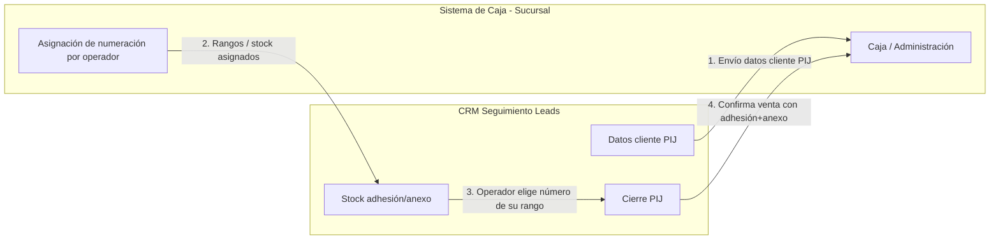

# Requisitos — Integración CRM ↔ Caja de sucursal (Plan Inversión Joven)

**Fecha:** 2026-07-13  
**Roles afectados:** promotor, supervisor, caja/sucursal, DBA  
**Estado:** pendiente de especificación (requisitos iniciales)  
**Productos en alcance:** Plan Inversión Joven (`prod-pij`)

Documento vivo: se amplián conforme lleguen más definiciones de negocio / DBA / sistema de caja.

---

## 1. Resumen

El CRM de Seguimiento de Leads **enviará a un sistema de caja en sucursal** los datos del cliente asociados a un cierre de **Plan Inversión Joven**.

A la inversa, el CRM **recibirá de ese sistema de caja** los **números de adhesión y anexo** que la sucursal asigna a cada **promotor / supervisor**, en forma de **stock de numeración** (rangos: desde número X hasta número Y).

En el cierre PIJ, el operador **no inventará** adhesión/anexo libres: **elegirá** un número disponible de su stock (o el stock de su equipo, según se defina).

Esto es distinto de:

| Doc / integración | Relación con este requisito |
|--------------------|-----------------------------|
| [datos_crm_caja_unificado.md](./datos_crm_caja_unificado.md) | Catálogo de datos del CRM útiles para caja (contexto técnico). |
| [PROPUESTA_INTEGRACION_ADHESIONES.md](./PROPUESTA_INTEGRACION_ADHESIONES.md) | Lectura de adhesiones ya facturadas vía `adhesionesPorVendedorGestion` (histórico en STRSYSTEM). |
| [INTEGRACION_SOAP_PIJ_SISTEMA_INTEGRAL.md](./INTEGRACION_SOAP_PIJ_SISTEMA_INTEGRAL.md) | **WS del ingeniero** `altaModificaPlanJoven` — envío de venta + imágenes al sistema integral. |
| **Este documento** | Flujo **bidireccional** con **caja de sucursal**: recepción de **stock** de adhesión/anexo + envío; el alta formal en el integral es el SOAP. |

---

## 2. Flujo de alto nivel

1. **Sucursal → CRM:** asigna a cada promotor/supervisor un stock de numeración (ej. adhesiones `100`–`150`, anexos `200`–`250`).
2. **CRM (cierre PIJ):** el operador elige, de lo disponible en su stock, la adhesión y el anexo a usar.
3. **CRM → Caja:** envía los datos del cliente / cierre PIJ (payload a definir) para que la sucursal registre u opere la caja.
4. **Consumo de stock:** al confirmar el cierre, esos números salen del stock disponible (regla a confirmar).

---

## 3. Dirección 1 — CRM → Caja (datos del cliente PIJ)

### Objetivo

Que la caja de la sucursal reciba la información del cliente y de la operación PIJ cargada en el CRM.

### Datos candidatos a enviar (partir del modelo actual del CRM)

Basado en el cierre PIJ actual (`entrega_33`):

| Dato | Origen actual en CRM | Notas |
|------|----------------------|-------|
| ID lead / encuesta | `lead.id` | Clave de relación |
| Nombre cliente | `lead.nombre` | |
| Teléfono | `lead.telefono` / seguimiento | |
| DNI cliente | `seguimiento.dniCliente` / `dni_cliente` | Si ya está desplegado |
| Promotor / supervisor | `idVendedor`, operador del cierre | Quién cerró |
| Fecha cierre | `fechaCierre` | |
| Medio de pago | `formaPago`, montos | efectivo / transferencia / mixto |
| Serie / adhesión / anexo | `seriePij`, `nroAdhesion`, `nroAnexo` | Elegidos desde el stock |
| Recibo texto | `numeroRecibo` | ej. `B135/300 ANEXO 75/300` |
| Documentación | imágenes cierre (`img1`…`img7`) | DNI, anexo, transferencia, etc. |
| Compras adicionales | tabla / array de ventas extra | Cada una con su propio adhesión/anexo |

### Pendiente de definición

- [ ] Endpoint / SP / cola / archivo que usa la caja de sucursal.
- [ ] Momento del envío: al guardar el cierre, al confirmar en caja, o en batch.
- [ ] Identificador de **sucursal**.
- [ ] Respuesta esperada de la caja (ACK, nro interno, rechazo).
- [ ] Qué pasa si falla el envío (reintento, cola, cierre solo local).

---

## 4. Dirección 2 — Caja → CRM (stock de adhesión / anexo)

### Objetivo

Que cada promotor/supervisor vea en el CRM **solo** la numeración que la sucursal le asignó, y elija al cerrar PIJ desde ese stock.

### Concepto de stock

| Concepto | Descripción |
|----------|-------------|
| **Asignación** | La sucursal define, para un operador (o código vendedor), rangos de adhesión y/o anexo. |
| **Rango** | “Desde número A hasta número B” (inclusive), opcionalmente por **serie** (`A` / `B`). |
| **Disponible** | Números del rango **aún no usados** en un cierre CRM (y/o no anulados). |
| **Usado** | Número ya asociado a un cierre PIJ (principal o compra adicional). |

### Reglas de negocio propuestas (a validar)

| Condición | Resultado esperado |
|-----------|-------------------|
| Operador cierra PIJ y tiene stock | Debe **seleccionar** adhesión y anexo de su stock disponible (no tipeo libre, o tipeo solo si está en stock). |
| Operador sin stock | No puede cerrar PIJ hasta que la sucursal asigne numeración (o mensaje claro). |
| Número ya usado | No aparece como disponible / se rechaza al guardar. |
| Compra adicional PIJ | Consume **otro** par adhesión+anexo del mismo stock (o stock del equipo). |
| Supervisor vs promotor | ¿Stock propio, stock del equipo, o ambos? **Pendiente.** |

### Pendiente de definición

- [ ] Unidad de stock: ¿solo adhesión, solo anexo, o siempre el par?
- [ ] ¿La serie (`A`/`B`) viene en la asignación de la sucursal?
- [ ] ¿Quién carga los rangos en caja: admin de sucursal, DBA, ambos?
- [ ] API/SP de consulta: stock por `idVendedor` / código promotor / sucursal.
- [ ] Sincronización: pull al abrir el modal de cierre, push desde caja, o ambos.
- [ ] Anulación / devolución de número al stock si se corrige un cierre.

---

## 5. Impacto en el CRM (cuando se implemente)

Hoy el cierre PIJ permite ingresar **manual** serie + N° adhesión + N° anexo (`LeadModalForm` + columnas planas / tablas hijas).

Con este requisito, el UI debería evolucionar hacia:

1. Cargar stock del operador logueado (o del equipo).
2. Selectores de **adhesión disponible** y **anexo disponible** (filtrados por serie si aplica).
3. Al guardar, persistir como hoy (`serie_pij`, `nro_adhesion`, `nro_anexo`, `numero_recibo`) y **marcar el stock como usado**.
4. Enviar payload de cliente/cierre a la caja de sucursal.

### Capas posibles (referencia, aún no implementadas)

| Capa | Posible ubicación |
|------|-------------------|
| Dominio | `src/domain/pij-stock.ts` (validar número en rango, formatear) |
| UI | `LeadModalForm.tsx` / selectores de adhesión-anexo |
| API | `GET /api/.../stock-pij`, `POST` consumo / envío a caja |
| Backend | `server/services/...`, integración con SP o API de caja |
| SQL | Tablas de stock / consumo (o solo lectura desde STRSYSTEM/caja) |

---

## 6. Relación con el modelo de datos PIJ actual

Datos ya modelados en el CRM que este flujo usará:

- Venta principal: `serie_pij`, `nro_adhesion`, `nro_anexo`, `forma_pago`, montos, `dni_cliente`.
- Compras adicionales: `registrarSeguimientoLead_compra`.
- Imágenes: `registrarSeguimientoLead_imagen` (`img1`…`img7`).

Ver también: [DESPLIEGUE_COLUMNAS_PLANAS_SEGUIMIENTO.md](./DESPLIEGUE_COLUMNAS_PLANAS_SEGUIMIENTO.md).

---

## 7. Criterios de aceptación (borrador)

1. La caja de sucursal puede **recibir** un aviso/payload con datos de cliente PIJ del CRM.
2. El CRM puede **recibir o consultar** rangos de adhesión/anexo asignados por operador.
3. En un cierre PIJ, el operador **elige** números de su stock (no números fuera de rango).
4. Un número consumido **no** queda disponible para otro cierre.
5. Compras adicionales PIJ respetan la misma regla de stock.

---

## 8. Preguntas abiertas (siguiente conversación)

1. ¿Qué sistema exacto es la “caja de sucursal” (nombre, base, API)?
2. ¿Formato del rango: inclusivo? ¿huecos permitidos? ¿solo enteros?
3. ¿Stock por sucursal + operador, o solo por `idVendedor`?
4. ¿El CRM sigue pudiendo tipeo libre en algún rol (ej. superadmin)?
5. ¿El envío a caja incluye fotos (bytes / URLs) o solo metadatos?
6. ¿Hay un número fijo de “/300” en el texto de recibo fijo por producto?

---

## 9. Historial de requisitos

| Fecha | Cambio |
|-------|--------|
| 2026-07-13 | Alta del documento: envío CRM→caja de cliente PIJ; recepción de stock adhesión/anexo por promotor/supervisor; selección desde numeración asignada. |
| 2026-07-13 | Aclaraciones SOAP: bloqueo (datos+adhesión+anexo+DNI) → `idVenta`; luego fotos; `domicilioCliente` = encuesta; `imgSolicitud` = `img5`. |
